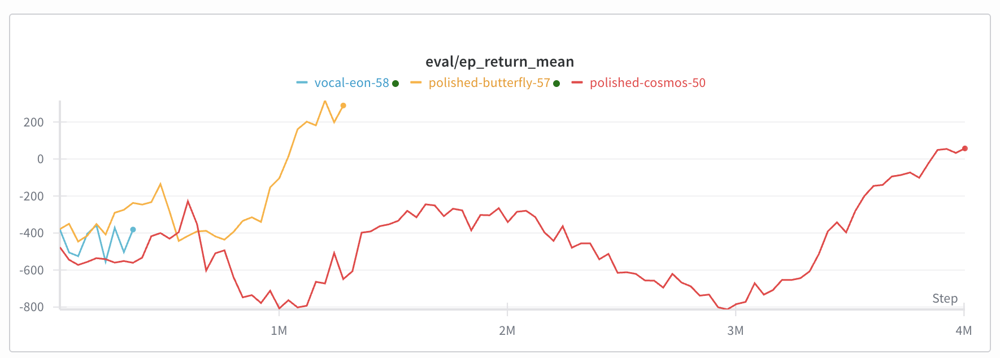

# MPO From Scratch

```bash
python3 -m venv .venv
source .venv/bin/activate
pip install numpy torch matplotlib "gymnasium[mujoco]" tensorboard wandb
pip install imageio[ffmpeg]

python src/main.py --seed 42 --num_training_episodes 10000
python src/generate_video.py logs/mpo_experiment/checkpoints/checkpoint_ep309.pt --env_name HalfCheetah-v5 --output mpo_halfcheetah.mp4
```

## Eval



## Cheeting cheetah


