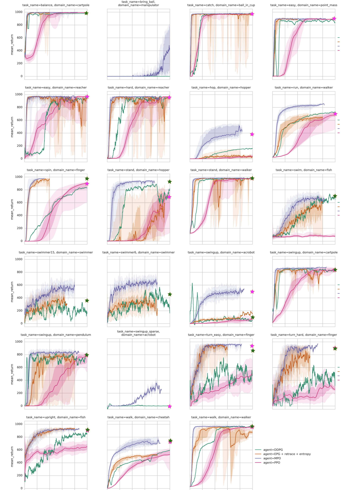
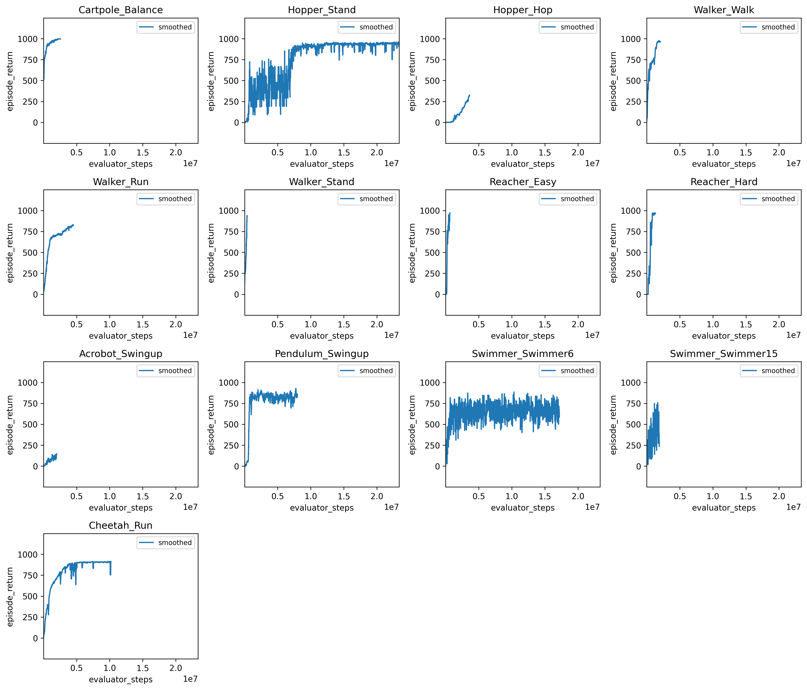
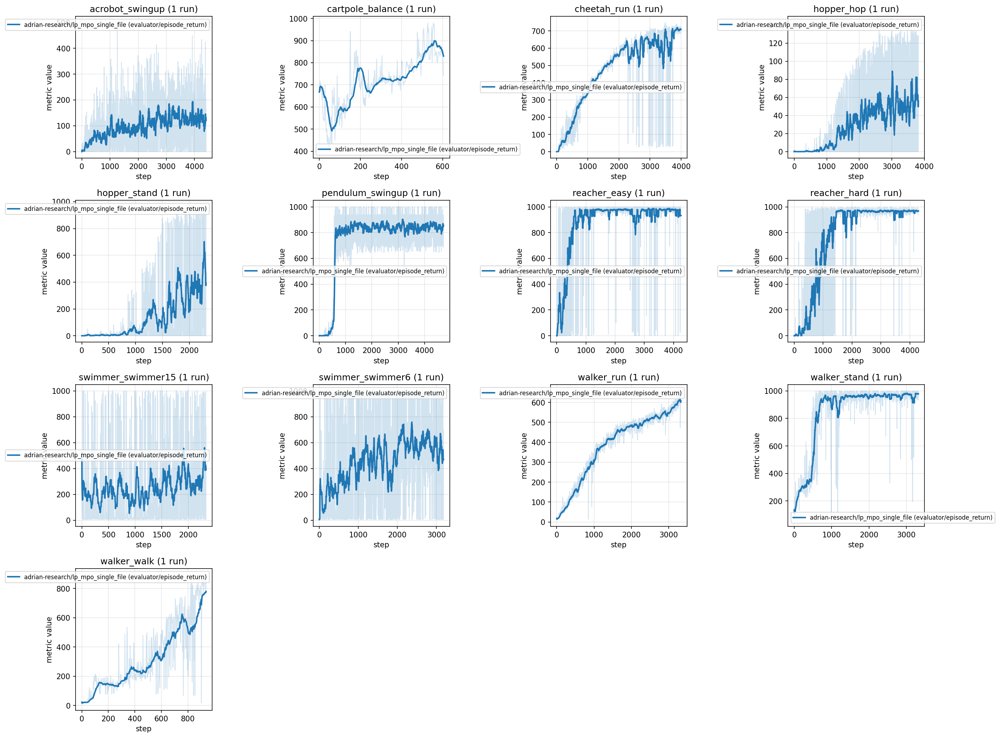
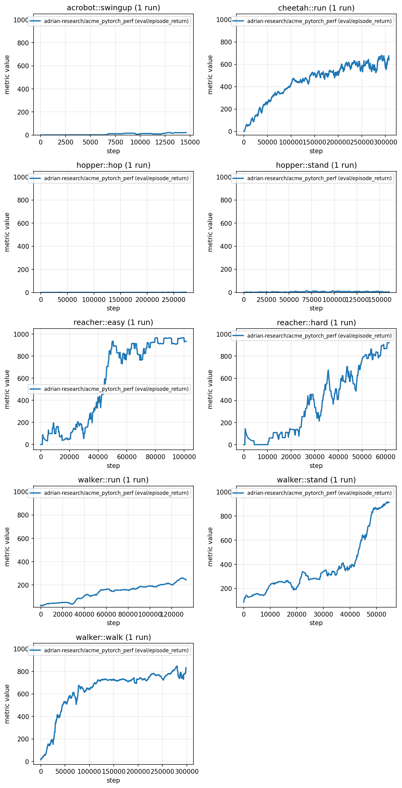
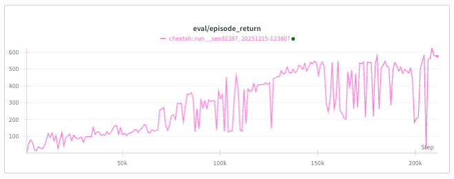
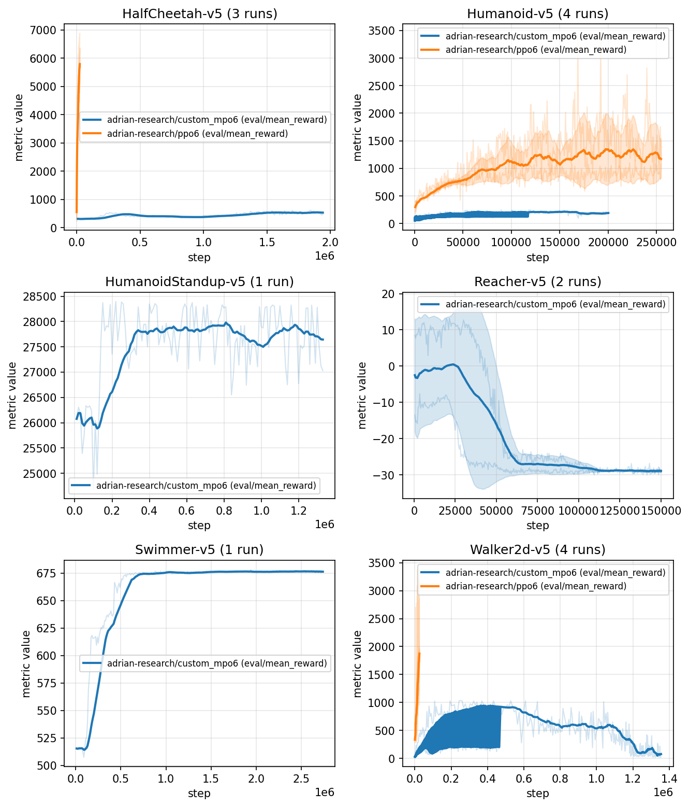

# On implementing Maximum a Posteriori Policy Optimization (MPO)

- [On implementing Maximum a Posteriori Policy Optimization (MPO)](#on-implementing-maximum-a-posteriori-policy-optimization-mpo)
  - [Original MPO Paper](#original-mpo-paper)
  - [Using Google DeepMind Acme](#using-google-deepmind-acme)
    - [I - Single file Acme TF with Launchpad and other dm- dependencies (ATFLDM)](#i---single-file-acme-tf-with-launchpad-and-other-dm--dependencies-atfldm)
      - [Visualize ATFLDM](#visualize-atfldm)
    - [II - Single file Acme TF with only dm-Reverb and dm-Sonnet (ATFRS)](#ii---single-file-acme-tf-with-only-dm-reverb-and-dm-sonnet-atfrs)
      - [Visualize ATFRS](#visualize-atfrs)
  - [III - PyTorch implementation based on ATFRS](#iii---pytorch-implementation-based-on-atfrs)
    - [Visualize AcmePyTorch](#visualize-acmepytorch)
    - [Video generation AcmePyTorch](#video-generation-acmepytorch)
  - [IV - Single-threaded Implementation if III](#iv---single-threaded-implementation-if-iii)
  - [V - Implementation from scratch in PyTorch (not working)](#v---implementation-from-scratch-in-pytorch-not-working)
    - [Visualize](#visualize)
    - [Video generation](#video-generation)
  - [Discovery: ACME – Google DM](#discovery-acme--google-dm)
    - [Overview](#overview)
    - [Notes](#notes)
    - [Important Code](#important-code)
      - [Maximum a Posteriori Policy Optimisation (MPO)](#maximum-a-posteriori-policy-optimisation-mpo)
      - [Distributional MPO (DMPO)](#distributional-mpo-dmpo)
      - [Multi-Objective MPO (MO-MPO)](#multi-objective-mpo-mo-mpo)
      - [Mixture of Gaussian Distributional MPO (MoG-DMPO)](#mixture-of-gaussian-distributional-mpo-mog-dmpo)
    - [Baselines](#baselines)
    - [MPO Benchmarks](#mpo-benchmarks)
    - [RLAX – Google DM](#rlax--google-dm)
      - [Overview rlax](#overview-rlax)
      - [Important Docs and Code](#important-docs-and-code)
  - [Other Implementations](#other-implementations)

## Original MPO Paper



## Using Google DeepMind Acme

Very difficult to get it to build. TensorFlow version is only one that I was able to get working: [examples/tf/control_suite/lp_mpo.py](https://github.com/nenuadrian/acme/blob/master/examples/tf/control_suite/lp_mpo.py).

```bash
python examples/tf/control_suite/lp_mpo.py
```

### I - Single file Acme TF with Launchpad and other dm- dependencies (ATFLDM)

Somewhat consolidated code from within acme still depending on acme but brought toegther in one file. Depends on many DM projects such as `dm-reverb`, `dm-env`, `dm-tree`, `dm-launchpad`, `acme`, `sonnet` etc.

[src/acme_launchpad_tf/train_lp_mpo_single_file.py](src/acme_launchpad_tf/train_lp_mpo_single_file.py)

```bash
python src/acme_launchpad_tf/train_lp_mpo_single_file.py --max_actor_steps 3000000 --domain cheetah --task run
```

#### Visualize ATFLDM

```bash
python src/acme_launchpad_tf/visualize_acme_results.py --output results/acme_tf.png --metric episode_return --file "Cartpole_Balance::results/acme/mpo-tf-cartpole-balance.csv" --file "Hopper_Stand::results/acme/mpo-tf-hopper-stand.csv" --file "Hopper_Hop::results/acme/mpo-tf-hopper-hop.csv" --file "Walker_Walk::results/acme/mpo-tf-walker-walk.csv" --file "Walker_Run::results/acme/mpo-tf-walker-run.csv" --file "Walker_Stand::results/acme/mpo-tf-walker-stand.csv" --file "Reacher_Easy::results/acme/mpo-tf-reacher-easy.csv" --file "Reacher_Hard::results/acme/mpo-tf-reacher-hard.csv"  --file "Acrobot_Swingup::results/acme/mpo-tf-acrobot-swingup.csv"   --file "Pendulum_Swingup::results/acme/mpo-tf-pendulum-swingup.csv"  --file "Swimmer_Swimmer6::results/acme/mpo-tf-swimmer-swimmer6.csv" --file "Swimmer_Swimmer15::results/acme/mpo-tf-swimmer-swimmer15.csv" --file "Cheetah_Run::results/acme/mpo-tf-cheetah-run.csv" 
```



### II - Single file Acme TF with only dm-Reverb and dm-Sonnet (ATFRS)

Not able to remove dependencies further as Sonnet and Reverb are tightly integrated. But removed Acme and Launchpad dependencies. [src/acme_tf_custom/train_acme_tf_mpo.py](src/acme_tf_custom/train_acme_tf_mpo.py)

```bash
python src/acme_tf_custom/train_acme_tf_mpo.py --max_actor_steps 3000000 --domain cheetah --task run
```

#### Visualize ATFRS

```bash
python src/visualize_wandb.py --project-metric "G_ACME_TF_CUSTOM::evaluator/episode_return"  --entity "adrian-research" --cache-dir logs --show-individual --output results/custom_acme_tf.png --ncols 2
```



## III - PyTorch implementation based on ATFRS

Python 3.10/3.11 is recommended. Based on the TF single file above.

```bash
python3 -m venv .venv_acme_pytorch
source .venv_acme_pytorch/bin/activate
pip install numpy pandas torch matplotlib "gymnasium[mujoco]" tensorboard wandb "shimmy[bsuite,atari,dm-control]" opencv-python torchrl


python src/acme_pytorch/train_custom_acme_pytorch_mpo.py --max_actor_steps 3000000 --wandb_project acme_pytorch_3 --env_name walker::walk
```

### Visualize AcmePyTorch

```bash
python src/visualize_wandb.py --project-metric "acme_pytorch_perf::eval/episode_return" --entity "adrian-research" --cache-dir logs --show-individual --output results/custom_acme_pytorch.png
```



### Video generation AcmePyTorch

```bash
python src/acme_pytorch/generate_video_acme_pytorch_mpo.py logs/mpo_experiment/identifier/checkpoints/checkpoint_34234.pt --env_name cheetah::run --output mpo_acme_pytorch_cheetah_run.mp4
```

## IV - Single-threaded Implementation if III

[src/acme_pytorch_sync/train_custom_acme_pytorch_mpo.py](src/acme_pytorch_sync/train_custom_acme_pytorch_mpo.py)

Cheetah::run



## V - Implementation from scratch in PyTorch (not working)

```bash
python3 -m venv .venv
source .venv/bin/activate
pip install numpy pandas torch matplotlib "gymnasium[mujoco]" tensorboard wandb "imageio[ffmpeg]" torchrl

python src/pytorch_custom/train_custom_pytorch_mpo.py --wandb_project custom_mpo9 --max_actor_steps 1500000 --env_names HalfCheetah-v5,Walker2d-v5 --env_iterations 1
```

### Visualize

```bash
python src/visualize_wandb.py --project-metric "ppo6::eval/mean_reward" --project-metric "custom_mpo6::eval/mean_reward" --entity "adrian-research" --cache-dir logs --show-individual --output results/custom_pytorch.png
```



### Video generation

```bash
python src/pytorch_custom/generate_video_custom_pytorch_mpo.py logs/mpo_experiment/checkpoints/checkpoint_ep309.pt --env_name HalfCheetah-v5 --output mpo_halfcheetah.mp4
```


## Discovery: ACME – Google DM

### Overview

- **Paper:** [2006.00979] *Acme: A Research Framework for Distributed Reinforcement Learning*  
- **Code:** https://github.com/google-deepmind/acme/tree/master  
- **Agents:** https://github.com/google-deepmind/acme/blob/master/docs/user/agents.md?plain=1  
- **Docs:** https://dm-acme.readthedocs.io/en/latest/

### Notes

- Installation is difficult due to deprecated libraries, old NumPy versions, and CUDA dependencies that are incompatible with current GPUs.
- A fork was created with modified `setup.py` and `README.md`, but errors persist:  
  https://github.com/nenuadrian/acme
- Test files do not run; version constraints are inconsistent and incompatible.
- Official notebooks (Acme tutorial, Colab) do not work.
- After extensive manual fixes, the framework still fails to run reliably.
- Unable to execute successfully on CPU, GPU, or TPU.

### Important Code

#### Maximum a Posteriori Policy Optimisation (MPO)

- **Paper:** [1806.06920] *Maximum a Posteriori Policy Optimisation*  
- **Code:**
  - https://github.com/google-deepmind/acme/tree/master/acme/agents/jax/mpo  
  - https://github.com/google-deepmind/acme/blob/master/acme/agents/tf/mpo  

#### Distributional MPO (DMPO)

- **Paper:** Unpublished  
- **Inspiration:** C51 — [1707.06887] *A Distributional Perspective on Reinforcement Learning*  
- **Docs:** https://dm-acme.readthedocs.io/en/latest/user/agents.html#continuous-control  
- **Code:** https://github.com/google-deepmind/acme/tree/master/acme/agents/tf/dmpo  

#### Multi-Objective MPO (MO-MPO)

- **Paper:** [2005.07513] *A Distributional View on Multi-Objective Policy Optimization*  
- **Site:** https://sites.google.com/view/mo-mpo/humanoid  
- **Code:** https://github.com/google-deepmind/acme/tree/master/acme/agents/tf/mompo  

#### Mixture of Gaussian Distributional MPO (MoG-DMPO)

- Uses Gaussian mixture critics instead of C51-style categorical critics.  
- **Paper:** [2204.10256] *Revisiting Gaussian Mixture Critics in Off-Policy Reinforcement Learning: A Sample-Based Approach*  
- **Code:**
  - https://github.com/google-deepmind/acme/tree/master/acme/agents/tf/mog_mpo  
  - https://github.com/google-deepmind/acme/tree/master/acme/agents/jax/mpo  
- Comments in code indicate support for:
  - MoG vs non-MoG critics
  - Continuous vs discrete policies

### Baselines

- https://github.com/google-deepmind/acme/blob/master/examples/baselines/rl_continuous/run_dmpo.py  
- https://github.com/google-deepmind/acme/blob/master/examples/baselines/rl_continuous/run_mogmpo.py  
- https://github.com/google-deepmind/acme/blob/master/examples/tf/control_suite/lp_mpo.py  
- https://github.com/google-deepmind/acme/blob/master/examples/tf/control_suite/lp_dmpo.py  

### MPO Benchmarks

- [2006.00979] *Acme: A Research Framework for Distributed Reinforcement Learning*  
- [2204.10256] *Revisiting Gaussian Mixture Critics in Off-Policy Reinforcement Learning: A Sample-Based Approach*  
- [2005.07513] *A Distributional View on Multi-Objective Policy Optimization*  

### RLAX – Google DM

#### Overview rlax

- Functional RL library used by Acme.
- **Code:** https://github.com/google-deepmind/rlax/tree/main  
- **Docs:** https://rlax.readthedocs.io/en/latest/index.html  

#### Important Docs and Code

- **MPO Compute Weights and Temperature Loss:**  
  https://rlax.readthedocs.io/en/latest/api.html#mpo-compute-weights-and-temperature-loss  

- **MPO Loss:**  
  https://rlax.readthedocs.io/en/latest/api.html#mpo-loss  

- **MPO Compute Weights and Temperature Loss (duplicate reference):**  
  https://rlax.readthedocs.io/en/latest/api.html#id1  

- **VMPO Loss:**  
  https://rlax.readthedocs.io/en/latest/api.html#vmpo-loss  

---

## Other Implementations

- **JAX (≈5 years old, could not run):**  
  https://github.com/escontra/MPO-JAX.git  

- **PyTorch (≈5 years old, could not run):**  
  https://github.com/acyclics/MPO  

- **PyTorch (≈5 years old, could not run):**  
  https://github.com/daisatojp/mpo
