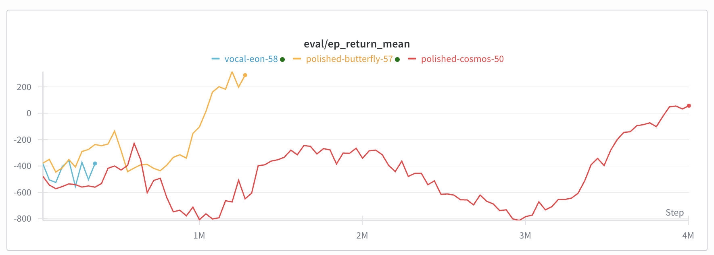
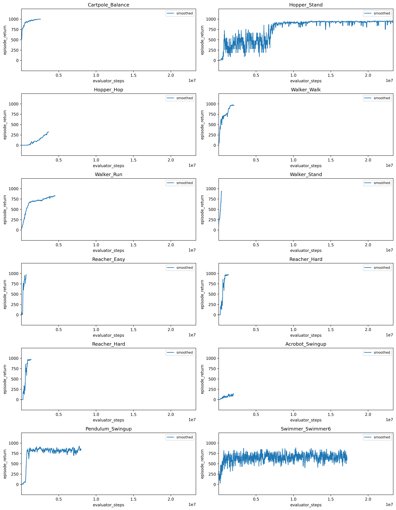

# On implementing Maximum a Posteriori Policy Optimization (MPO)

## Implementing from scratch in PyTorch

```bash
python3 -m venv .venv
source .venv/bin/activate
pip install numpy pandas torch matplotlib "gymnasium[mujoco]" tensorboard wandb "imageio[ffmpeg]"

python src/train_custom_pytorch_mpo.py --wandb_project custom_mpo9 --num_training_episodes 10000 --env_names HalfCheetah-v5,Walker2d-v5 --env_iterations 3

python src/generate_video.py logs/mpo_experiment/checkpoints/checkpoint_ep309.pt --env_name HalfCheetah-v5 --output mpo_halfcheetah.mp4
```

### Eval



### Cheeting cheetah


### visualize

```bash
python src/visualize.py --project-metric "ppo6::eval/mean_reward" --project-metric "custom_mpo6::eval/mean_reward" --entity "adrian-research" --cache-dir logs --show-individual
```

## Using Google DeepMind Acme

Very difficult to get it to build. TensorFlow version is only one that I was able to get working.

Combined all code necessary in `src/train_acme_lp_tf_mpo.py`. But still need a lot of the tricks I have documented in my `acme` fork.

### visualise

```bash
python src/plot_acme_results.py --output results/acme/metric_plot.png --metric episode_return --file "Cartpole_Balance::results/acme/mpo-tf-cartpole-balance.csv" --file "Hopper_Stand::results/acme/mpo-tf-hopper-stand.csv" --file "Hopper_Hop::results/acme/mpo-tf-hopper-hop.csv" --file "Walker_Walk::results/acme/mpo-tf-walker-walk.csv" --file "Walker_Run::results/acme/mpo-tf-walker-run.csv" --file "Walker_Stand::results/acme/mpo-tf-walker-stand.csv" --file "Reacher_Easy::results/acme/mpo-tf-reacher-easy.csv" --file "Reacher_Hard::results/acme/mpo-tf-reacher-hard.csv" --file "Reacher_Hard::results/acme/mpo-tf-reacher-hard.csv"  --file "Acrobot_Swingup::results/acme/mpo-tf-acrobot-swingup.csv" 
```



## Implementing based on Acme in PyTorch

Python 3.10/3.11 is recommended.

```bash
python3 -m venv .venv_acme_pytorch
source .venv_acme_pytorch/bin/activate
pip install numpy pandas torch matplotlib "gymnasium[mujoco]" tensorboard wandb "shimmy[bsuite,atari,dm-control]"


python src/train_custom_pytorch_mpo.py --max_steps 500000 --wandb_project acme_pytorch_1 --env_names walker::walk,humanoid::run,cartpole::balance,walker::run,reacher::easy,reacher::hard,hopper::hop,walker::stand,acrobot::swingup,swimmer::swimmer6,swimmer::swimmer15,pendulum::swingup,cheetah::walk,cheetah::run --env_iterations 1
```
