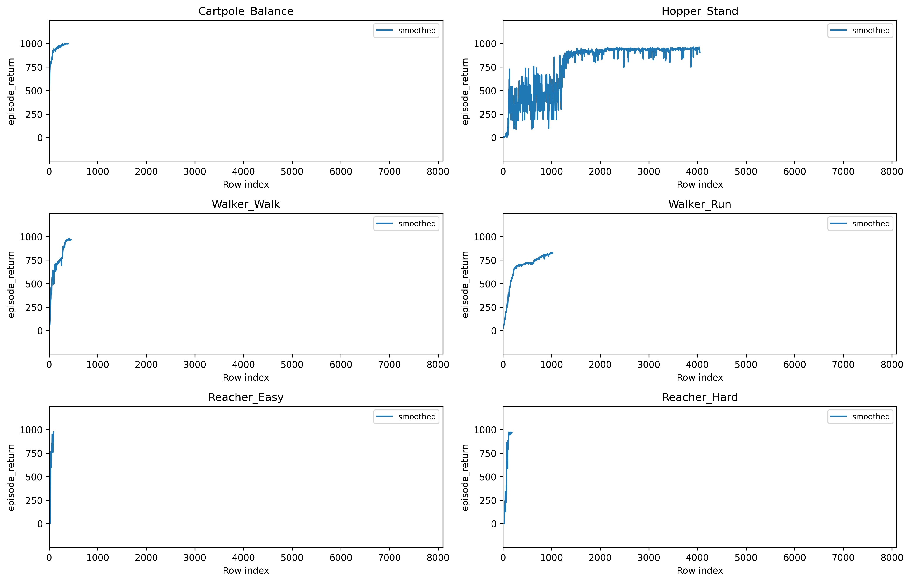

# MPO From Scratch

```bash
python3 -m venv .venv
source .venv/bin/activate
pip install numpy pandas torch matplotlib "gymnasium[mujoco]" tensorboard wandb "imageio[ffmpeg]" "shimmy[bsuite,atari,dm-control]"

python src/train.py --num_training_episodes 10000 --env_names HalfCheetah-v5,Walker2d-v5 --env_iterations 3

python src/generate_video.py logs/mpo_experiment/checkpoints/checkpoint_ep309.pt --env_name HalfCheetah-v5 --output mpo_halfcheetah.mp4
```

## Eval


## Cheeting cheetah


## visualize

```bash
python src/visualize.py --project-metric "ppo6::eval/mean_reward" --project-metric "custom_mpo6::eval/mean_reward" --entity "adrian-research" --cache-dir logs --show-individual
```

## Acme

### visualise

```bash
python src/plot_acme_results.py --output acme-results/metric_plot.png --metric episode_return --file "Cartpole_Balance::acme-results/mpo-tf-cartpole-balance.csv" --file "Hopper_Stand::acme-results/mpo-tf-hopper-stand.csv" --file "Walker_Walk::acme-results/mpo-tf-walker-walk.csv" --file "Walker_Run::acme-results/mpo-tf-walker-run.csv" --file "Reacher_Easy::acme-results/mpo-tf-reacher-easy.csv" --file "Reacher_Hard::acme-results/mpo-tf-reacher-hard.csv"
```


